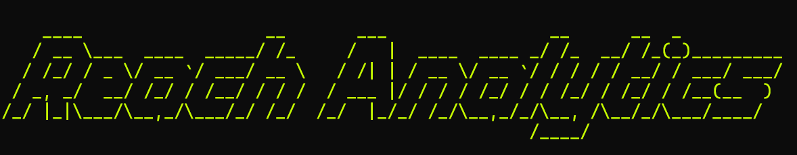

Reach analytics is an AI automated development program intended to tackle heavy analytics
workloads such as machine learning model development, validation, and testing.

## Analytics is live!: [Reach Analytics Site](https://reachai.streamlit.app/)... Testing datasets are available in the sidebar

Also be sure to check out [Reach Search](https://github.com/willgbryan/reach_search),
and some early UI testing at [Reach PoD](https://github.com/willgbryan/reach_PoD)!

Example use cases include but are not limited to:
- Demand forecasting
- Cluster modeling and regressions
- Neural network classification
- Recommendation systems

## Table of Contents
- [Prerequisites](#prerequisites)
- [Installation (the easy way)](#installation-preferred)
- [Installation (the hard way)](#installation-experimental-and-kind-of-annoying-at-times)
- [Building the Docker Image](#building-the-docker-image)
- [Running the Container](#running-the-container)
- [Environment Variables](#environment-variables)
- [Runtime Options](#runtime-options)
- [License](#license)

## Development Prerequisites

Before you begin, ensure you have met the following requirements:

- You have installed the latest version of [Docker](https://docs.docker.com/get-docker/).
- You have a Windows, Linux, or Mac machine.
- You have read the related documentation or sections.

## Installation (Preferred)

1. Clone the repository:

```bash
gh repo clone willgbryan/reach_analytics
```

2. Navigate to the directory where the repository is cloned:

```bash
cd reach_analytics
```

3. Navigate to the 'reach_core_folder' directory:

```bash
cd reach_core_folder
```

4. Add your 'OPENAI_API_KEY' by running the following command:

```bash
export OPENAI_API_KEY='your_api_key'
```

5. Run the following command to get started (See the Runtime Options sections for valid runtime commands):

```bash
python reach_main.py
```

## Installation (Experimental and kind of annoying at times)

To install reach analytics, you need to clone the repository and build the Docker image. Follow these steps:

1. Clone the repository:

```bash
gh repo clone willgbryan/reach_development
```

2. Navigate to the directory where the repository is cloned:

```bash
cd reach_development
```

3. Proceed to the "Building the Docker Image" section to build your Docker image.

## Building the Docker Image

Before running the container, you need to build the Docker image from the Dockerfile. Navigate to the root directory of the project where the Dockerfile is located and run the following command:

```bash
docker build -t reach-analytics
```

This command will build the Docker image with the tag `reach-analytics` from the Dockerfile in the current directory (denoted by the `.`).

- `docker build` is the command to build the image.
- `-t reach-analytics` tags the built image with the name `reach-analytics` for easy reference.
- The `.` specifies the build context to the current directory.

After the image has been successfully built, you can proceed to run the container as described in the "Running the Container" section.

Make sure to replace `reach-analytics` with your preferred image name if you wish to use a different tag.

## Running the Container

To build the Docker image, run the following command:

```bash
docker run -e OPENAI_API_KEY='your_api_key' -p 5000:5000 <your-image-name>
```

Replace `'your_api_key'` with your actual OpenAI API key.

## Environment Variables

To run this project, you need to add the following environment variables to your Docker container:

- `OPENAI_API_KEY`: Your OpenAI API key for accessing the OpenAI API.

## Runtime Options

Currently reach analytics supports three inputs:

```bash
file-upload
```
For uploading new data to the program.

```bash
process-prompt
```
For prompting the program to generate results.

```bash
clear-data
```
For wiping the systems conceptual understanding of provided data.

## License

This software is the property of reach. All rights reserved. No part of this software may be reproduced, distributed, or transmitted in any form or by any means, including photocopying, recording, or other electronic or mechanical methods, without the prior written permission of the owner.

For license inquiries, please contact Will Bryan: will.bryan421@gmail.com.

## Starting the app in UI mode (Recent changes require that 'ui' is passed as a system arg to start the ui)

Route to /placeholder1/reach-frontend and run `npm start`. This will launch the main page on port 3000.

Open and run the reach_main.py file. This will start up the flask app. The flask app will remaining running until it is stopped or a significant error causes a program exit.

## Connecting the backend using Flask

Flask enables defined methods or classes to act as API's with defined input request formats. In [reach_main.py](three/reach_main.py), the following code is used to configure the flask app and declare necessary file paths for functions such as uploading documents:

```python
app = Flask(__name__)
CORS(app)
upload_folder = 'web_upload/datasets'
app.config['UPLOAD_FOLDER'] = os.path.join(os.getcwd(), upload_folder)
os.makedirs(app.config['UPLOAD_FOLDER'], exist_ok=True)
```

The entirety of the app is defined by:

```python
app = Flask(__name__)

"""App configuration and app.routes"""

if __name__ == '__main__':
    app.run(debug=True)
```

Within the app, defined in [reach_main.py](three/reach_main.py), the following define 3 possible request bodies that can be sent to the app via the frontend: [main_page.js](reach-frontend/src/main_page.js) in its current state.

```python
@app.route('/process_prompt', methods=['POST']) 
@app.route('/upload_files', methods=['POST'])
@app.route('/datasets/<path:filename>', methods=['GET']) 
```

In [main_page.js](reach-frontend/src/main_page.js), the following handles sending the user input value within the text box to the flask app as a POST request:

```javascript
const handleSubmit = async () => {
      setIsGeneratingAnalytics(true);
      const response = await fetch('http://localhost:5000/process_prompt', {
        method: 'POST',
        headers: {
          'Content-Type': 'application/json',
        },
        body: JSON.stringify({ prompt: inputValue }),
      });
```

The above code is called within the following div component:

```javascript
 <div className={`${hasSubmitted ? 'p-4' : 'flex-grow flex items-center justify-center'}`}>
          <div className="flex items-center space-x-2">
            {fileNames.length > 0 && (
              <button
                onClick={handleSubmit}
                className="bg-green-500 hover:bg-green-700 text-white font-bold py-2 px-4 rounded"
              >
                Submit
              </button>
            )}
```

The return type for each method is defined by the python function being called. In it's current state, return responses are the string body outputs with no additional handling.

This is likely a very complicated implementation that can be refined for increased readability.
